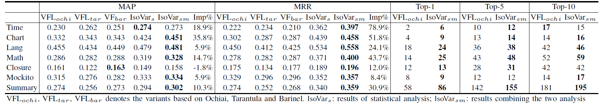
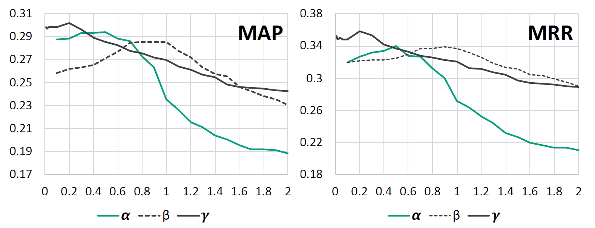

# Results for IsoVar
this repository is raised to show the results for IsoVar

## RQ1 : Effectiveness of IsoVar
Table [1](RQ1.png "The Performance of IsoVar and VFL with respect to Different Metrics") shows the performance of IsoVar on different projects w.r t. different metrics and the according comparisons with VFL.
Specifically, we listed the results of IsoVar obtained
via including only the statistical analysis and including both
the statistical and mutation analysis (i.e., denoted as IsoVars
and IsoVarsm respectively). We also showed the results of
three variants of VFL based on Ochiai, Tarantula and Barinel (we select such three variants since they achieved the optimum performance).

Table 1: The Performance of IsoVar and VFL with respect to Different Metrics

Each VFL based on Ochiai, Tarantula and Barinel as well as IsoVar for each bug can be found at RQ1 folder. 
for example, [Chart_VFL_tarantula](RQ1/Chart_VFL_tarantula.txt) is the result of tarantula for all the bugs in the Chart, below is the first line of the file
>Chart/Chart_1	[16]	0.058823529411764705	0.058823529411764705

The first column represents the bugid, the second column indicates the ranking of each oracle, the remaining two columns represent AP and RR respectively.
There are 3 lines at the bottom of the file, indicating the MAP, MRR and TOP-n of the project.
In addition, [Chart_phase#1.txt](RQ1/Chart_phase#1.txt) is the results of statistical analysis for Chart by IsoVar, [Chart_phase#2](RQ1/Chart_phase#2.txt) is the results combining the two analysis by IsoVar.
*******
## RQ2 : Segmenting IsoVar’s Contributions
In this RQ, we investigate the contributions of the statistical analysis and mutation analysis, as well as the impact of those parameters involved in the design of IsoVar (i.e. \alpha, \beta and \gamma in Equation 4,5,6).

Figure 1: Impacts of Different Parameters

Figure [1](alpha_beta_gamma.png "Impacts of Different Parameters") shows the impacts of different parameters on the performance of IsoVar w.r.t. MAP and MRR, which reveal that different parameters indeed will cast certain impact on IsoVar’s performance.
All detail data can be found in RQ2 folder, we vary the value of \alpha from 0 to 2, and observe the performance of IsoVar w.r.t. MAP and MRR.
You can get the MAP and MRR situation when taking different parameters in the RQ2 folder.  

- [Chart_0.1.txt](RQ2/phase#1_alpha/Chart_0.1.txt) in RQ2/phase#1_alpha means we take 0.1 as \alpha and observe performance under this setting.
- [Chart_0.1.txt](RQ2/phase#2_beta/Chart_0.1.txt) in RQ2/phase#2_beta means we take 0.1 as \beta and fix the value of alpha and gamma to 0.5 to observe the impacts of different \beta.
- [Chart_0.1.txt](RQ2/phase#3_gamma/Chart_0.1.txt) in RQ2/phase#2_gamma means we take 0.1 as \beta and the fix alpha value is 0.5, and the beta value is 1 to observe the impacts of different \gamma.
***
## RQ3 : RQ3: Usefulness of IsoVar
